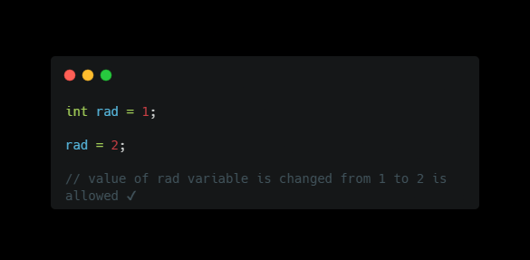
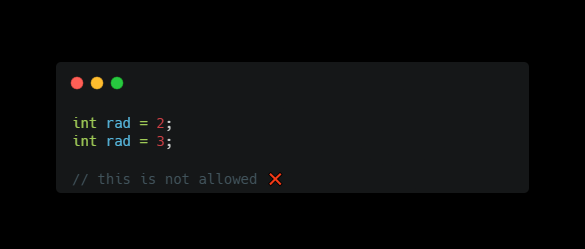
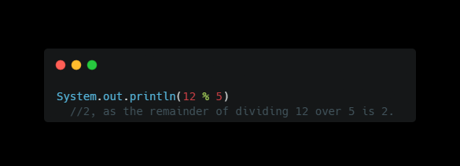
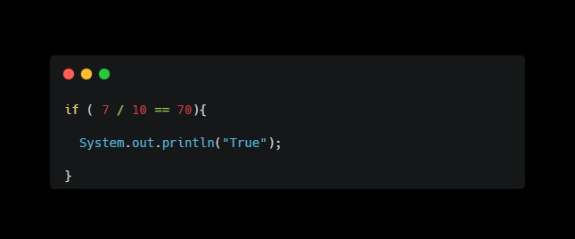
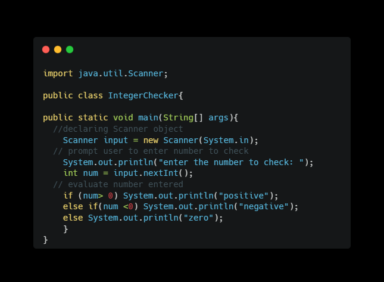
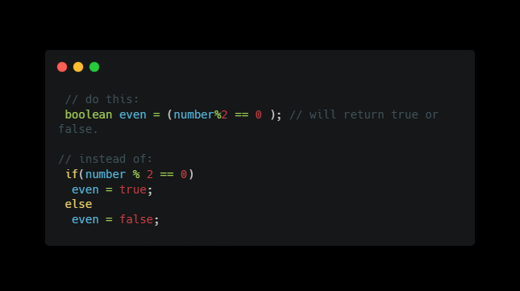
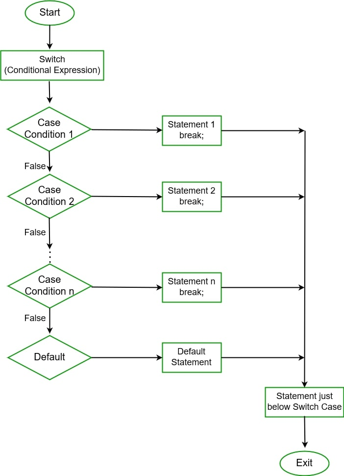
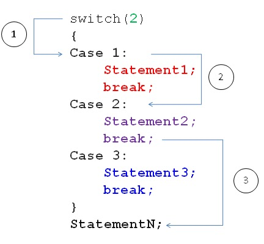
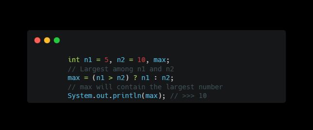

# Java Miniatures

Java Miniatures is a comprehensive repository dedicated to honing Java programming skills and delving into software engineering concepts. As a passionate Computer Science graduate aspiring to excel in the field of Software Engineering, I've curated this repository to serve as a platform for my continuous learning journey and to showcase my expertise in Java programming.

## **What the Repository Does:**

The repository encompasses a wide range of **Java topics**, starting from fundamental concepts and progressing towards more advanced **software engineering principles**. Each section of the repository is meticulously crafted to provide clear explanations, code examples, and practical projects, all aimed at deepening understanding and mastery of Java and its application in real-world software development scenarios. The repo will include the fundamental Computer Science topics.

## **Challenges Faced and Future Features:**

Throughout this learning journey, I've encountered various challenges, both technical and conceptual. However, each challenge has served as an opportunity for growth and learning. In the future, I aim to implement additional features such as interactive coding exercises, more extensive project examples, and collaborative learning opportunities to further enhance the repository's utility and effectiveness as a learning resource.

## **Important:**

This repository **IS NOT A ROADMAP FOR LEARNING JAVA** exactly, you can use different arrangement e.g. If you want to learn generics first before knowing about frameworks (e.g.spring boot) it won't cause a problem, I use this repo more likely as a documentation for my programming skills progress, how my code, thinking, experience in using java change over time in addition to aiming to be a good reference in future (ISA) for whom are concerned about learning java and software engineering.

<details>
<summary> <H1>Table of Contents</H1></summary>

<details>
<summary> <H3>Part One : Pick up your weapon !</H3></summary>

<details><summary><strong>Java Basics</strong></summary>

1. Elementary Programming
2. Control Structures Part 1: (_Selections_)
3. Mathematical Functions,Characters, and Strings
4. Control Structures Part 2: (_Iterators_)
5. Methods
6. Arrays
</details>

<details><summary><strong>Object-Oriented Programming</strong></summary>

1. Objects and Classes
2. Object-Oriented Thinking
3. Inheritance and Polymorphism
4. Exception Handling and Text I/O
5. Abstract Classes and Interfaces</details>

<details><summary><strong>Java in Action</strong></summary>

1. Build tools

- Ant
- Maven
- Gradle

2. building GUI

- JavaFX
- Java Swing

3. Web Frameworks

- Spring
- Spring-boot

4. ORM

- JPA
- Hibernate

</details>

<details><summary><strong>Advanced Java Topics</strong></summary>

1. Binary I/O
2. Generics
3. How JVM works
4. Multithreading and Parallel Programming
5. Networking
6. Java Database Programming</details>

<details><summary><strong>Data Structures</strong></summary>

1. Recursion
2. Stacks & Queues
3. Lists
4. Trees
5. Priority Queues
6. Maps & Hash Tables
7. Search Trees</details>

<details><summary><strong>Algorithms</strong></summary>

1. Asymptotic analysis
2. Sorting
3. Searching
4. Graphs
5. Strings</details>
</details>

<details><summary><H3>Part Two: Software Engineering Principles</H3></summary>

1.  OOA & OOD
2.  SOLID Principles
3.  Design Patterns
4.  Refactoring Techniques
5.  Software Development Methodologies
</details>

<details><summary><h3>Part Three: Projects</h3></summary>

1. Small-scale Java Projects
2. Medium-scale Software Engineering Projects
3. Real-world Application Examples</details>

<details><summary><H3>Cross-Part knowledge</H3></summary>

**_Challenges and Exercises_**

- Coding Challenges
- Problem-solving Exercises
- Algorithm Implementations

**_Resources_**

- Online Tutorials and Courses
- Recommended Books
- Useful Articles and Videos

**_Contributions_**

- How to Contribute
- Guidelines for Contributors
- Community Engagement Opportunities</details>

</details>


---

## Part One : 1 - Java Basics

### **Get-Started** :D 🔥

according to Java Docs official website [Oracle Docs](https://docs.oracle.com/en/java/).

> \'Java is a general-purpose, concurrent, strongly typed, class-based object-oriented programming language'

- #### _**`general puprose`**_ means you can build applications using this language in a wide range of different domains (Desktop applications, client/server applications/ web applications, Enterprise applications).

- #### _**`concurrent`**_ means the ability of the language to execute multiple processes in the same time. (This is kinda an advanced concept for beginners and maybe cs students in first 2 or three semesters)

- #### **_`strongly-typed`_** means the strict attachment of language syntax to define variables data types. (This will be explained and noticed as we go deep in the language)

- #### **_`class based object oriented`_** means this language structure is based on object-oriented concepts and use of classes.

Don't worry **these characteristics of the language will be more clear as we go down in this repo**

---

<details><summary><H3><strong>Installing JDK</strong></H3></summary>

### Installing JDK

To get started with java we must install JDK on our local machine, (here, I'm considering you are a beginner or totally newcomer in programming world or even didn't visit virtualization concepts|tools before).

Installing JDK is a **must** it provides the necessary tools and libraries to develop, compile, and run Java applications.

click on the following link [oracle](https://www.oracle.com/eg/java/technologies/downloads/) and install the latest JDK versions on your own device


> download and install JDK based on your os and processor architecture set

#### What's JDK?

"**_JDK_**" stands for Java Development Kit, it's the development environment for building java applications, it consists of JVM -_Java Virtual Machine_-, JRE -_Java Runtime Environment_- and development tools like compiler etc.


Java is machine independent language, or it's more descriptive to refer to it as **platform-independent**; you can run it on any platform, while the JVM is platform-dependent; different JVM is designed for each platform (Linux, Windows, macOS).

In other words, if we have three local devices, each of which has a different platform installed in it e.g.(windows, mac, linux), all is required to install a JVM for each device and the java files can run on any machine of them after compiling it just one time.

Once you downloaded the latest version of JDK here you have two options:

1.  if it's your first time downloading

    > you need to edit system environment variables first

    These instructions for Windows users only ⚠:

    - open your Program Files directory navigate till you find the jdk directory
    - open the bin directory then copy its path
      
    - press win key on your keyboard ⌨ then type in search bar down edit system environment variables
    - click on Environment Variables, from user variables choose path then click on edit
    - on path window click add new, then paste the path you copied earlier and press enter
    - click on move up to make it on the top of the list and voilà!

2.  if you've already installed earlier JDK version

    - open your cmd(win key, type cmd | win key + R then type cmd)

      - write the following:

                java -version

      

      I have JDK version 17 installed on my own, now we are going to switch it to the new version of JDK

      - we'll repeat the steps of the previous option (editing system environment variables, etc.)
      - Check your java version again in cmd (restart it if you didn't close it already)

      _and Voila!_

      

    </details>

---

<details><summary><H3><strong>1. Elementary Programming</strong></H3></summary>

### 1. Elementary Programming

Remember this part mentioned earlier ? [class-based](#class-based-object-oriented-means-this-language-structure-is-based-on-object-oriented-concepts-and-use-of-classes)

> Java is a **class-based object-oriented** programming language

Let's see how this concept was applied!

_*Writing your first Hello world program!*_:-D "programmers' traditional custom"

_prerequisites_ ⚠

> if you didn't install the jdk yet, go to [this part](#installing-jdk) and install it
>
> It's better if you have an IDE, till this point it's not mandatory yet ,but then it will be as we are not at the age of DOS anymore.

1.  If you don't have an IDE: (note: I won't let you stay lazy forever, you'll have to install it)

    - create a new directory (folder) for your java practice, right-click, new, text document
    - yes, that's it just empty text document, rename this document "HelloWorld.java"
    - open the document, as mentioned before java is class based so to write any instructions they **must be** inside classes, now let's type our first class:

            ```java
            public class HelloWorld{}
            ```

    > public & class are both keywords all written in lower case letters
    >
    > HelloWorld is the name of the class ,and it must be written in [pascal case](https://www.freecodecamp.org/news/snake-case-vs-camel-case-vs-pascal-case-vs-kebab-case-whats-the-difference/#pascal-case) (the first letter of each word is capital)
    >
    > inside the curly braces `{}` we are going to illustrate our code

    - keywords or reserved words are predefined words in a programming language with a specific use, you can't use them for naming (simply, because the compiler will be confused if it's the word used by the language to identify some order to be executed by the program ,or it's just a programmer defined variable)

    - every java program should at least have one class, to execute the program we should have a _main method_ (in other words method its name is "main")
    - inside our created class we define the main method as follows:

            ```java
             public static void main(String[] args){}
            ```

      > public, static, void, String are all keywords
      >
      > naming methods using [camelCase](https://www.freecodecamp.org/news/snake-case-vs-camel-case-vs-pascal-case-vs-kebab-case-whats-the-difference/#camel-case) in java if it consists of more than one word otherwise all lower case

    - the curly braces `{}` mean block of code, here we write the lines of code that will be executed, their place is after every class, method, control statements, specific keywords e.g. static keyword. They also represent a specific scope (we'll talk about this soon).
    - inside the curly braces of the main method we will print our first hello world

             ```java
             System.out.println("Hello World!");
             ```

      > **Do Not Forget The Semicolon!**
      >
      > any string is enclosed in double quotes
      >
      > System.out.println() is the method we'll use for printing anything on the terminal or console screen to user.

    - to run your program open your cmd `win + R type cmd then enter ↩`, in the same directory, if you cannot navigate to the directory where the java file lies, simply in the address bar of your folder window type cmd as follows:
      

    - inside cmd type `javac {yourfilename.java}` (don't forget the extension)

            javac replacethis.java

    

    - write the name of the file right with its correct format ,or you'll face `error: file not found`

    > **_javac_** stands for java compile, you'll notice that a `.class` file is created on your directory this is the `bytecode`. you compile one time and run the code infinitely.

    - to run the program write `java {yourfilename}` (note here without the extension).

    _and Voila!_


you can check the file here in this directory [Hello.java](/Test%20Files%20Elementary/Hello.java) file.

**Now we consider you a real programmer**

.jpg>)

#### java syntax:

- every programming language has a syntax defines it, simply like grammar in English defines how you form a sentence has context, similarly in programming the syntax allows you to write program instructions correct or with a context for the compiler.

- curly braces`{}` define a block of code -in other words **lines** of code- and also define scope.

- yup, just like C language semicolon is the statements terminator `;`

- `//` double slashes for single line comments and `/* comments lines go here */` for multiple lines of comments (for those who are new to programming, comments are sentences or lines won't be treated as code or instruction they will be ignored by the compiler, programmers use comments to clarify points about their code, like comments show incomplete implementation or reference to the original source code or even to clear confusion about the code they wrote)

- java is case-sensitive language (you get syntax error if you mistyped a keyword or wrote its letter capital rather than small or vice versa), e.g.

  > `Public void fun(){...}` --> syntax error (Public is not a keyword)

- parenthesis `()` follow functions names, flow control keywords like for, while, if...etc.

- while square brackets follow 'Array' types `[]` e.g.

  > `String[]` -> indicates array of type String.

- later in advanced java programming we will get familiar with the ArrayList, we will find the angle brackets `<>` follow ArrayLists keyword in which contain the Type of the ArrayList (ArrayList is simply resizable array) e.g.

  > `ArrayList<String>`.

- every java program must have at least one class.

- java program start execution from main method.

- string is enclosed in double quotes while character is enclosed in single quotes.

#### errors types:

- Syntax errors: mistyping, missing punctuation

- Runtime errors: occur while program is actually running if the IDE indicated a process cannot be carried out or through input errors.

- Logical errors (semantic) -cruel one😈-:
  the code actually works fine but doesn't give you the expected output e.g. you wanted to make simple program that multiply numbers. now look at the following code:

  > int x = 2, y = 2;
  >
  > int result = x + y;
  >
  > System.out.println(result); >>>> 4 looks fine nothing wrong, no errors, the result is right :)

  try again making y = 3 instead of 2

  > int x = 2, y = 3;
  >
  > int result = x + y;
  >
  > System.out.println(result); >>> 5 here there is a problem, the code is working fine as no errors appear but wait a minute 😅, a plus " + " sign where inserted instead of " * " multiplication sign.

  here where the error takes place, it's not in syntax, the code works fine but doesn't give you the expected results, this type of errors are dedicated and corrected using tests we will come to this point later.

for more on errors types here is a useful link [not for newcomers](https://www.geeksforgeeks.org/types-of-errors-in-java-with-examples/)
, this is nice introduction to errors [types of errors in java](https://www.scaler.com/topics/types-of-errors-in-java/).

#### Dealing with data in Java

- a variable is used to store data, you can think of variables as where we store values, these values can be numeric, string (group of characters), reference, etc.

- basic syntax to declare a variable in java

  > datatype {variable-name} = value;

  - declaring means you announce to your compiler about storage place of name (your variable name) and type (your variable type) and it has to reserve or allocate this amount of memory space.
  - definition is when you assign a value to this identifier or the variable, equal sign `=` is the assignment operator.
  - assignment is right-to-lef operation -**this is super important**-, as you say the value 3 is assigned to variable x of type integer for this statement `int x = 3;` .
  - obviously, we don't have to mention "**not to forget the damn semicolon `;` after each statement you write**", thank you :) .

- naming conventions:

  - camel case.
  - do not start naming a variable with a number
  - you can start your variable name with dollar sign `$` or with underscore `_`.
  - variables cannot be reserved words, e.g. you cannot name your variable '_static_' gives you syntax error.
  - for clean code early teaching purpose, choose meaningful names for your variables describe them.
  - do not contain spaces in your variable name, keep using camel case if your variable name is more than one word.

- data types:

  - In general, they are two types numerical or non-numerical, numerical like integers, floating point or decimal numbers, non-numerical like strings "Hello my name is" or boolean like True or False.
  - In java, they are two categories, primitive data types and reference data types, they are classified based on how they store data, primitive copies only values while reference hold the address to the value they just copied, if you couldn't understand this no problem it will be clear later.
  - primitive data types are:
    - byte
    - short
    - int
    - long
    - float
    - double
    - boolean
    - char
  - reference data type -the only one you'll use for now- is String (take care of the capital letter).
  - data types tell the compiler how much space to reserve for that variable in memory. 

- **note** as variable word declares, its value can be changes during the execution of the program, from this point let's get familiar with constants.

- constants cannot change their value, we declare them using `final` keyword then data type follows final then the constant name, e.g.
  > final float PI = 3.14;
  - Upper case as naming convention for constants.
- **note** you cannot re-declare variable but you can re-assign i, e.g.

  
  

#### simple operations:

- you can perform simple operations using binary arithmetic operators: `+ , - , * , / , %`

  - 'asterisk' `*` is used for multiplication, 'single slash' `/` is used for division, and `%` is called modulus gives you the remainder, e.g.

    

  - note that `=` means assignment not equality.

#### taking user input

- for taking custom input from user, either from console or keyboard input, we are going to start using classes.

- In java to take user input using three classes: Console, BufferedReader, and Scanner. For now, we will deal with Scanner only.

- First, we need to import the class, so using the keyword `import` we will invoke the `Scanner` class as follows:
  

  - note that even in import we don't forget the semi-colon :) .
    

- Then, we create a new object from Scanner class

  

  - we created object of name input of Scanner class using **new** operator.

  

- importing statement is placed before class declaration.

- simple java program takes input from user to calculate the area of a circle:
  you can simply see the file here: [ComputeCircleArea.java](/Test%20Files%20Elementary/ComputeArea.java)

  

- so, at any point you want to take user input:
  1. `import java.util.Scanner;`
  2. inside main method block of code
     `Scanner input = new Scanner(System.in);`
  3. based on what data you want to take, e.g. prompt user to enter integer:
     `int number = input.nextInt();`
     and that's it.

#### Jshell interactive tool as Java REPL (Read, Evaluate, Print, Loop)

- Read-Evaluate-Print Loop (REPL), which evaluates declarations, statements, and expressions as they are entered and immediately shows the results.

- it's an interactive tool for quickly prototyping java code, all without the need for a `public static void main` or the need to compile your code before executing it.

- it's super easy open your cmd or powershell and type jshell

- try simple declaring variable called hello, `var hello = "welcome to jshell"`


- find more on this link [how to use jshell](https://www.infoq.com/articles/jshell-java-repl/)

#### notes:

First Chapter is Finished!!! 

</details>

---

<details><summary><H3><strong>2. Control Structure Part 1: (_Selections_)</strong></H3></summary>

### 2. Control Structure Part 1: 
In this section you will learn **the way you take decision**.

According to documentation:

> control flow statements, break up the flow of execution by employing decision-making, looping, and branching, enabling your program to conditionally execute particular blocks of code.

Types of `Control Flow` statements:

1. Decision-making statements.
2. Iteration (Looping) statements.
3. Branching statements.

in this section we'll talk about **Selections** | **Conditionals** | **Decision Making statements**.

Conditional keywords: `if`, `else`, `else if`,`switch`,`case`,`break`.

#### 1. If statements:

Conditional statement evaluate a (condition) if it's true or false to perform set of instructions:


A `boolean` expression is expression will yield `true` or `false`, e.g. is 4 + 5 = 9? if their sum equal to nine so the answer is yes otherwise no. so, an expression will be given to be evaluated.

now, the question is **' How to build a conditional '** :

before anything let's learn about the second category you hear in this guide, **relational operators**:
`==`
`<=`
`>=`
`!=`
`>`
`<`

> note that assignment operator `=` is not the same as `==` equality operator, equality operator mean if the value of smth **equals** some value on the other hand the assignment operator assigns value to variable.

Conditionals evaluate boolean expressions, boolean expression are expression expected to have true or false as answer, so we are kinda building comparison statements.



it's simply like saying: is dividing 7 by 10 equals 70? if yes please print the result ,and if 'not' do nothing.

- Checking for alternatives:
  using else if we can check for alternatives, e.g.
  here is a simple program to check if a number is positive or negative or equal to 0:

  

- you can find more examples in Test Files Elementary, e.g. [addition Quiz](./Test%20Files%20Elementary/AdditionQuiz.java)

we can check using `if` then another `if` but what we hit the goal from first time why do we continue checking? that's why we use else if instead of to skip the rest of conditional statement checking if we already satisfied one.

#### notes:

- any boolean expression is enclosed by parenthesis `()`.
- if by mistake you placed a semicolon after if statement `if ( y == x );` is like doing this: `if ( y == x ){}` means do nothing.
- avoid redundant testing of boolean expression e.g. `if (even == true)` better do this `if (even)`, so if even have a number other than zero it still evaluate to true or if even a boolean variable it will evaluate to its boolean value.
- avoid equality test to float variables to avoid precision problem of floating point numbers.
- you can simplify boolean variable assignment:
  

now we could build simple conditionals using of, else and if else. What if we want to check two conditions at the same time, can we? actually yes, using compound boolean expressions we can check two conditions at the same time, but first let's get familiar with the logical operators:

`|| OR operator`

`&& AND operator`

`! NOT operator`

`^ XOR operator`

if you are a computer science, or electrical engineering student you are already familiar with these operators as you took this knowledge in Logic design course -probably it's name nearly like this-, if you or not here's a simple explanation ,and I'll provide you a link for a video to simplify the concept more:

OR operator `||` check if one of the expressions `at least` is true or both of them.
e.g. `(5+6 == 11 || 5+7 == 11)` evaluates to true because the first expression is true. it will only evaluate to false if both of them are false.

AND operator `&&` check if both of the expressions `must be true` if one of them is false so the whole evaluation of both of them will be false.

NOT operator `!` is to negate any value to oppose any expression in other words: !(expression) means to flip the evaluation value of this expression if it's evaluated to true the not operator will make it false and so on. same when we use `!=` we mean not equal.

XOR operator `^` is used to check if both expressions evaluates to different answers, simply if both of the expression is evaluated to true or both false it will return to us false, if they are different (true , false or false , true) return to us true.

we can use DeMorgan's law to best practise these compound boolean expression conditionals

> !(condition1 && condition2) == ! condition1 && ! condition2 using DeMorgan's.

**note** `&&` and `||` are called lazy operator as they perform short circuit concept as if `false && anything` evaluates to false without checking the second expression same in `true || anything` will evaluate to true without checking the second expression.

#### 1. Switch case statements:

we use switch case statements with menu-like -means many choices- problems, e.g. choosing operation to be done on numerical values, based on day of week chosen ;perform some action:





This is a simple program perform basic operations on the entered numbers:
you can check it from here [switch program](./Test%20Files%20Elementary/Calculator.java)


- if `break` is not used, switch will evaluate all other cases, we use default if the expression doesn't match any case.

lastly we will learn about the boolean ternary operator `(boolean expression)? (if true)expression1 : (if false)expression2` this operator return exp1 if it evaluates to true and exp if it evaluates to false, e.g. :



#### notes:

Second Chapter is Finished!!! 

</details>

---

<details><summary><H3><strong>3. Mathematical Functions,Characters, and Strings</strong></H3></summary>

### 3. Mathematical Functions,Characters, and Strings

In this section you will learn about some built-in mathematical functions in addition to introducing two data types (Character and String).

lets breakdown the concepts we are going to learn:

- Methods
- Important built-in methods
- example using these methods
- Character datatype
- Operations
- Casting
- String Reference Type
- Important methods for dealing with Strings
- Java String pool

before we go in methods with more details on the next Chapter, we can have quick definition help us to figure out what these block of codes mean.

> Methods can be used to define reusable code and organize and simplify coding, and make code easy to maintain.

We also refer to methods as routines and other words will be mentioned later, for now remember the word "reusable".

note: if you experienced other languages other than java you may find that methods are called functions, but with a programming language which is attached to Object-Oriented concepts you'll find the word 'method' is the convention here.

methods can be:

1. user defined
2. built-in

Before we go deeper in this

#### Why do we need methods?

##### Coffee Shop analogy:


**Imagine we have the following situation:**

Imagine you run a coffee shop. When customers come in and order coffee, the barista follows specific steps to make the coffee. If you have many customers, repeating these steps for each order can be exhausting and time-consuming


**Here is the ongoing scenario:**

> 1. 10 customers order coffee.
> 2. The barista follows the same steps for each coffee order.

**Identifying the problem:**
steps repetition for every customer in addition to time consumed

**Offered Solution: Introducing a coffee machine**

To improve efficiency, you introduce a coffee machine. The machine has buttons for different types of coffee. Now, the barista simply presses a button, and the coffee machine follows the predefined steps to make the coffee.

**Analogy to Methods:**

* **Without Methods:** The barista repeats the same steps (code) for each customer.
* **With Methods:** The barista uses the coffee machine (method) to make coffee efficiently.

#### Java Code Simulation:
##### Without Methods (Exhausting Process)


##### With Methods (Effective Process)


#### Analysis to what happened:
* **DRY Principle:** By using methods, we encapsulate the repetitive steps of making coffee into a single method makeCoffee. This follows the DRY principle by avoiding repetition of the same code.

* **Built-In vs. User-Defined Methods:** 
  
  **Built-In Methods:** These are like the common coffee machines available in the market. They perform **common** tasks and are part of the **Java Standard Library**. For example, **`System.out.println`** is a built-in method used to print messages to the console.

  **User-Defined Methods:** These are like the custom coffee machine **designed specifically** for your coffee shop. They perform specific tasks defined by the programmer. In our example, **`makeCoffee`** is a user-defined method that encapsulates the steps to make coffee.

For now in this chapter we're going to discuss built-in methods only.

<details><summary><strong>more about built-in functions</strong></summary>

  easy definition for these functions found on NinjaOne blog:

  > Built-in functions refer to those pre-defined functions that come along with a programming language. They are intrinsic components of the language’s library, ready to be used without requiring any additional installation or importation. These functions have been designed to perform common tasks, thus facilitating efficient and swift coding.

  for short: built-in functions or methods are pre-defined methods in the language library itself which are already implemented for you to perform common tasks.

  now lets getting familiar with them; first, I prefer to categorize them, so it's easily inside my head to choose the suitable one for the suitable situation:

  We'll use **Math** class for this mission, Math class in java contains all mathematical constants and methods you'll need to use, according to Oracle documentation:

  > The class Math contains methods for performing basic numeric operations such as the elementary exponential, logarithm, square root, and trigonometric functions. 
</details>

**Built-in Functions in Math Class:**

1. Trigonometric Methods
2. Exponential Methods
3. Service Methods (rounding, min-max-abs, random)


1- Trigonometric Methods:
| Method | Description |
| ----------- | ----------- |
|  `sin(radians)` | Returns the trigonometric sine of an angle in radians. |
|  `cos(radians)`  | Returns the trigonometric cosine of an angle in radians.|
|  `tan(radians)` | Returns the trigonometric tangent of an angle in radians. |
| `toRadians(degree)` | Returns the angle in radians for the angle in degrees. |
|  `toDegrees(radians)` | Returns the angle in degrees for the angle in radians. |
| `asin(a)` |Returns the angle in radians for the inverse of sine. |
| `acos(a)` | Returns the angle in radians for the inverse of cosine. |
| `atan(a)` | Returns the angle in radians for the inverse of tangent. |

2- Exponential Methods:

| Method | Description |
| ------ | ----------- |
|`exp(x)` |Returns e raised to power of x (ex).|
| `log(x)` | Returns the natural logarithm of x (ln(x) = loge(x)).|
| `log10(x)` | Returns the base 10 logarithm of x (log10(x)).|
| `pow(a, b)`| Returns a raised to the power of b (ab).|
| `sqrt(x)` | Returns the square root of x (2x) for x7 =0.|

3- Service Methods:
  * Rounding Methods
  * The min, max, and abs Methods
  * The random()Method

**Rounding Methods**

The best way to understand rounding methods in Math class in java is by example:


**The min, max, and abs Methods**


  * The min and max methods return the minimum and maximum numbers of two numbers

  * The abs method returns the absolute value of the number 
  
Here is a worked example:


**The random() Method**

In my own opinion random method is super important in a lot of situations, for example in programs used for making test models, in the preceding chapters and projects you'll figure this out

> This method generates a random double value greater than or equal to 0.0 and less than 1.0


#### Simple Application !

there is a little application "Calculate Theta value" calculates the value of the angle between any two vectors using dot product
you can take a look on the application here, whereas you can find how can we use **Math Class** built-in functions are used.
[Calculate Theta](/Test%20Files%20Elementary/CalculateTheta.java) 


**For now we addressed the following:**
* **Methods**
* **Important built-in methods**
* **example using these methods**

-----
### Character data type and String reference type:

#### Character Data Type:

Character data type is used to represent single character surrounded by single quotes. `char firstLetter = 'S'`

Caution ⚠

> characters must be surrounded by single quotes while Strings must be surrounded by double quotes, thus "S" is a String and 'S' is a character my this is not important in other languages like: Python but here it's essential to differentiate between them as java s a strongly static typed language

If you are not a computer science student ,or you are not familiar with the idea of how computers deals with data, so expand this section, if you are familiar go to the next points

---
<details><summary><h4>How computers deal with data</h4></summary>

#### How computers deals with data?
You need to know what machine language is. Machine language is the language that computers actually understand. This language consists of 0's and 1's based on the fact that computers, at their core, consist of transistors that can be switched to two states: ON or OFF (1 or 0). From this, the binary system was born.


The processes are carried out in a central processing unit (CPU), which performs the necessary mathematical operations for processing incoming data. It handles all computing tasks required for running the operating system and applications.


Anything represented in a high-level language, like "Human Language," is too complex for computers to understand directly. This is where the role of the CPU and other computing components comes in, translating this data into something understandable to the computer, known as "machine language." 

Similarly, computers don't understand characters directly; they need a translator. This can be a lengthy process that we won't delve into deeply here, but the main idea is conveyed. 

Computers only understand binary data, binary code, or machine language. They represent everything (text, images, sound, etc.) using binary.


Today, no one deals with 0's and 1's directly. This level of operation is abstracted within the computer hardware.

Here are videos will help you so much for understanding the topic:

- [khan academy](https://www.khanacademy.org/computing/computers-and-internet/xcae6f4a7ff015e7d:digital-information/xcae6f4a7ff015e7d:bits-and-bytes/v/khan-academy-and-codeorg-binary-data) : short and informative


- [How computers Actually work](https://youtube.com/shorts/CZY881WyrB8?si=dGyKynD_p2trawy1) : the same
  
- [How computers Actually work -The detailed video- ](https://www.youtube.com/watch?v=5f3NJnvnk7k) : for more details 

A good article about how data is stored and how computers deal with it: [How data is stored in computers](https://www.datarecoveryspecialists.co.uk/blog/how-is-data-in-a-computer-stored)


Since you may not be familiar with computer science, I'll recommend a superior playlist. The videos are relatively short and very informative:  [Crash Course computer science](https://www.youtube.com/playlist?list=PL8dPuuaLjXtNlUrzyH5r6jN9ulIgZBpdo)

- **`note` You can watch this playlist to get an idea of what computer science is and how it has evolved over the decades. It will help you pick up keywords, history, important names, applications, etc. However, it's not for in-depth study.**

- Watch the playlist like your daily series; you'll learn amazing things about this field that has revolutionized humanity in the last decade!

Another one, but this time you cannot just watch and enjoy, also I want to inform its lectures are long, but super informative recommended from almost everyone ,and it's considered as one of the most common and best introductions to computer science,
CS50 - from Harvard [CS50](https://www.youtube.com/playlist?list=PLhQjrBD2T381WAHyx1pq-sBfykqMBI7V4)

**`Note`: You don't need to master this topic to understand character data types. Just grasp the main idea. If you want to delve deeper into computer science, these playlists and courses are great resources. These playlists take time, and it's okay to keep learning without finishing them first. You can do both in parallel.**

**I address the problem of getting bored due to the huge and often complicated information for the first time to understand. When you get bored and decide to stop, you risk losing out on important knowledge. You may end up with incomplete knowledge about a language that could be crucial for your future job. Instead, you could spend that time learning something enjoyable, like how to bake the perfect cinnabon! 🥯😂**
</details>

----
#### Characters and Encoding

- Computers use binary numbers internally. A character is stored in a computer as a sequence of `0s and 1s.` 
  
- Mapping a character to its binary representation is called `encoding`. (encoding is converting data from one format to another)
  
- There are different ways to encode a character. How characters are encoded is defined by an `encoding scheme`.
  
- Java supports `Unicode`, an encoding scheme established by the Unicode Consortium to support the interchange, processing, and display of written texts in the world’s diverse languages.
  
- Before Unicode, ASCII encoding scheme were used; a standard data-encoding format for electronic communication between computers encoding scheme, it was 7 bits (every bit can represent either one or zero) so it could hold only 128 characters English characters with some punctuation and control features then it was expanded to be 8 bits to hold 256 characters.
  
- other encoding schemes are widely used today like UTF-8 which is algorithmic mapping in addition to providing backward compatibility with ASCII. 
  
#### Character Encoding Analogy! Teaching Colors with a Numbered Painting Sketch

**If we want to teach a child how to get used with colors and their names we use the `Numbered Painting Sketch`**
- `Encoding`: in the context of `The Numbered Painting Sketch`, Encoding is like the painting sketch where each sector of the drawing is assigned (encoded to) a unique number (1 for red color, two for green, 21 for mint green, etc.).


  
- Just as each sector in the sketch has a number to indicate which color to use, encoding assigns a unique number to each character so that it can be stored and identified correctly.
  
- `encoding schema` or `Unicode`: **The Color Table**
  
  
  
  Unicode is like the color table that shows which number corresponds to which color.

  The table ensures that no matter what color you need, there's a specific number assigned to it.

  Similarly, Unicode assigns a unique code point to every character in every language, ensuring a universal standard.

- `UTF-8`: The Flexible Coloring Kit
  
  UTF-8 is like a coloring kit that adapts to the complexity of the drawing.

  - In the coloring kit: Simple, common colors (like "Red") might be represented by one marker.
  
  - More complex, less common colors might be represented by more markers. 

  - This makes the kit efficient and flexible, capable of handling all sorts of drawings (characters) without wasting resources.
  
  

------
#### **Now we can introduce the data type :)**

you define the character data type using **`char`** keyword, then give it a name and assign a character value to it.

> **Caution**⚠ don't forget that characters must be surrounded by single quotes **`' '`**.

**Why did we introduce the character encoding with all this staff? to understand the following**
 
 


 **Here you can see that character data type can store numeric value and weird code starts with **`\u`** but how?**

 In Java, the char data type can store numeric values, but these values are not interpreted as numbers by Java. Instead, they are treated as their corresponding ASCII or Unicode characters. For example, the character 'a' has an ASCII value of 97. In Unicode, the same character is represented as \u0061. 

 > **`note`** The increment and decrement operators can also be used on char variables to get the next or preceding Unicode character. For example, the following statements display character b:

 

 > also, numerical operations are allowed ,but you'll get numeric output

 

 #### Escape Sequences for Special Characters

 if you know already C you maybe familiar with these characters 

 `Escape characetr` is a character preceded by a backslash `\` is an escape sequence and has special meaning to the compiler.

 from Oracle java tutorial:
 > When an escape sequence is encountered in a print statement, the compiler interprets it accordingly. For example, if you want to put quotes within quotes you must use the escape sequence, `\"`, on the interior quotes. To print the sentence

> She said "Hello!" to me. you would write:


 

|Character|Name|
|-----|----|
|`\b`|**Backspace**|
|`\t`|**Tab**|
|`\n`|**Linefeed**|
|`\f`|**Form feed**|
|`\r`|**Carriage Return**|
|`\\`|**Backslash**|
|`\"`|**Double Quote**|

**Don't worry if you are not familiar with some terms like "`carriage return`" here is clarification:**

- **`Carriage return`** means to return to the beginning of the current line without advancing downward. (Abbreviated CR)

- **`Linefeed`** means to advance downward to the next line (Abbreviated LF or NL) **`CRLF is used for the pair "\r\n"`**.

- **`Formfeed`** means advance downward to the next "page".
***
#### Casting
Now let's move to new topic (Casting) which will be expanded later when you got familiar with OOP.

> Casting : is a process that converts a variable's data type into another data type, casting may be **implicit** (auto) or **explicit**.

Characters (char) can be converted to numerical data types because characters are internally represented by numeric values according to the Unicode standard, **thus** character data type can be cast into any numeric type and vice versa.

- `note 1`: character data type is `2 bytes` so only the lower 16 bits of data are used when casting from numeric into character

- `note 2`: if you cast a floating number data to character, first the float data will be cast into integer then character


When a `char` is cast into a numeric type, the character’s Unicode is cast into the specified numeric type.


> **`⚠ note`** Implicit casting can be used if the result of a casting fits into the target variable. Otherwise, explicit casting must be used.

- All data type reserves different amount of space in memory, so it's important to take this in consideration when casting, char is 2 bytes, boolean is one byte while integer is 4 bytes.

- Two characters can be compared using the relational operators just like comparing two numbers. This is done by comparing the Unicodes of the two characters.
  - for example:
  
   

taking the advantage that we got familiar with built-in functions, let's use the built-in functions which can be used to perform some tests on characters:

|Method|Description|
|---|---|
|`isDigit(ch)` |Returns true if the specified character is a digit.|
|`isLetter(ch)` |Returns true if the specified character is a letter.|
|`isLetterOrDigit(ch)` |Returns true if the specified character is a letter or digit.|
|`isLowerCase(ch)` |Returns true if the specified character is a lowercase letter.|
|`isUpperCase(ch)` |Returns true if the specified character is an uppercase letter.|
|`toLowerCase(ch)` |Returns the lowercase of the specified character.|
|`toUpperCase(ch)` |Returns the uppercase of the specified character.|

**`note`** to use character built-in function, it's like Math class you have to import Character Class as follows:


Character data type is finished!!!
****

#### String reference type

A `string` is a sequence of characters.

> "Hello, World!" >>> the most popular string ever in programming world!

Strings are enclosed by double quotes `" "`.

> again and again characters are surrounded by single quotes ,and it's a must ,or they will be considered as strings 

`note` : Strings are immutable 'you cannot change their value' ⚠

#### Reference Types in Java
In Java, there are two main categories of data types: **primitive** types and **reference** types.

**`Primitive Types`**: These include `int`, `char`, `boolean`, etc. They store simple values.

**`Reference Types`**: These include objects like **`Strings`**, **`arrays`**, and **`custom classes`**. They store references (or addresses) to the actual data in memory.

In other words, Any class can be used as a `reference type`, and any variable declared using this reference type is called reference variable or an object. 

- For now, the class is like a template and the object is the custom version you make from this template. 
- Objects and Classes will be discussed in details **LATER** :)

So, like **Scanner** class you have to follow the naming convention and capitalize the first letter of the class name: 

     ```java
     String sentence = "Hello, Developer!"; 
     ```

**STRINGS IS A SUPER IMPORTANT TOPIC IN ALMOST ALL AREAS OF  PROGRAMMING**

**SO, KEEP YOUR FOCUS ON THIS TOPIC**

#### String Operations

Now we are going to discuss the most important concepts that are necessary to know about strings:

- How to get the length of a string
- Concatenating Strings
- Trimming Strings
- Find character/s | substring/s in a given string
- Comparing Strings 
- Converting and reading strings as user input.


#### For short this is a table containing all the needed methods to perform the mentioned tasks:

| Method|  Description| 
| ---| ---- |
| `length()`|  Returns the number of characters in this string.| 
| `charAt(index)`|  Returns the character at the specified index from this string.| 
| `concat(s1)`|  Returns a new string that concatenates this string with string s1.| 
| `toUpperCase()`|  Returns a new string with all letters in uppercase.| 
| `toLowerCase()`|  Returns a new string with all letters in lowercase.| 
| `trim()`|  Returns a new string with whitespace characters trimmed on both sides.| 
|`equals(s1)`| Returns true if this string is equal to string s1.|
|`equalsIgnoreCase(s1)`| Returns true if this string is equal to string s1; it is case insensitive.|
|`compareTo(s1)`| Returns an integer greater than 0, equal to 0, or less than 0 to indicate whether this string is greater than, equal to, or less than s1.|
|`compareToIgnoreCase(s1)`| Same as compareTo except that the comparison is case insensitive.|
|`startsWith(prefix)`| Returns true if this string starts with the specified prefix.|
|`endsWith(suffix)`| Returns true if this string ends with the specified suffix.|
|`contains(s1)`| Returns true if s1 is a substring in this string|

**1- Getting String Length**
- you'll use strings almost for everything, getting a string length is important if you are going to iterate over this string for any task or to check if the returned data is matching from their lengths. 
- an instance method `length()` returns to you the length of the given string.
- **here comes another question, What is an instance method?** 
    - till now, we've passed by static and instance methods, static methods like Math.rint(), Math.sin()... , `length()`method here is the first instance method we meet.
    - regarding mentioning classes and objects earlier without details, for now instance methods are methods tied to a specific object (relies on specific data) and static methods are methods which are not tied to a specific object they only cling to the class itself that's why you invoke them using the class name itself and not the reference variable (object).
    - clarification: 
      - Think of a school where students and classrooms play important roles:
        - Instance Methods: Imagine each student has their own notebook. The notes in these notebooks are personal and unique to each student. For example, a student's grades or personal notes are tied to that specific student. In the same way, instance methods in a class belong to specific objects (or instances) of that class. These methods can access and modify the instance variables of the object they belong to.
      - 
        

        - Static Methods: Now, think about the whiteboard in a classroom. The whiteboard is a shared resource that any teacher can use to teach any student. The information on the whiteboard is not tied to any specific student; it can be used by all students collectively. Similarly, static methods belong to the class itself, not to any particular instance. These methods can be called without creating an instance of the class and cannot access instance variables directly. Instead, they work with class-level data.

        

        - this is the difference noticed when you use static methods of Math class like round(), as rounding number doesn't rely on specific data, but length() from String class is tied to specific object data, in our case here [`sentence`](#string-reference-type) string above, you return the length of this specific string object.
  
you can check this example here about how to use length() method [Check Password Length example](/Test%20Files%20Elementary/CheckingPasswordLength.java)


****

#### Learn by example:

we're going to explain each method and common use cases by examples in addition to clarifying any ambiguity:

- **charAt(index) method**
  
  let's clarify a point, string as mentioned earlier is a sequence of characters, people who already familiar with programming or already tried C/C++ knew that string is an array of characters, each character is indexed.

  The (string variable).charAt(index) method can be used to retrieve a specific character in a string s,where the index is between 0 and (string variable).length()–1.

  > **`note`** ⚠ a common programming error **"StringIndexOutOfBoundsException."** if you tried to access character which is our of array bounds as we count from zero, so charAt(string.length()) will expose you to this error :) 


       String message = "Welcome to Java";
      
       System.out.println(message.length());


  


<details><summary><strong>To Someone Totally New to Programming</strong></summary>

  - Imagine you have a row of lockers, and each locker has a number on it, starting from 0. These numbers help you find and open a specific locker quickly.

  - A string is like a row of lockers, but instead of holding things, it holds characters (letters, numbers, symbols, etc.). Each character in the string has a number called an index, which tells you its position in the row.

  For example, in the string "Hello":

  - The first character 'H' is at index 0
  - The second character 'e' is at index 1
  - The third character 'l' is at index 2
  - The fourth character 'l' is at index 3
  - The fifth character 'o' is at index 4
  
  So, if you want to find or use a specific character, you can refer to its index number, just like you'd find a specific locker by its number.


  > ⚠ **`note`** in programming by default we count from 0 index

</details>

example on using charAt(index) method: [email validation](/Test%20Files%20Elementary/CheckingEmailElgibility.java)


- **concat(s1) method**:
  
  concatenation is one of the most important concepts you need to learn about strings, concatenation means merging two strings together <3

  concatenation is achieved using multiple ways, one shortcut is by using plus sign '+' between two strings as follows:

        ``` java
            String name = "Sarah";
            String greeting = "Hello, " + name;
            System.out.println(greeting);
            //prints >>> Hello, Sarah 
        ```
  also `+=` operator can be used with strings:

         ```java 
            String studentsNames = "";  //empty string
            studentsNames += input.next();
            // enetrs Mariam 
            System.out.println(studentsNames);
            // prints Mariam as the empty string is concatenated with the user input "Mariam"
        ```

  using s2.concat(s1) method:

      ```java

           String spongepopFandomgreeting = "Hi Hi,"; 
           String name = "Captain";
           spongepopFandomgreeting = spongepopFandomgreeting.concat(name);
           System.out.println(spongepopFandomgreeting);
          //prints Hi Hi, Captain

      ```
  > `note` the reassignment happened above with `spongepopFandomgreeting` because the method concat(s1) returns a string ,so it must be stored in string variable or update an existing string variable.

  you can concatenate strings with any data type resulting a new string with all the concatenated values

  


- **trim(), toUpperCase(), toLowerCase() methods**:

   The `toLowerCase()` method returns a new string with all lowercase letters, and the `toUpperCase()` method returns a new string with all uppercase letters. For example:

       ``` java
           String convertToLower = "Welcome".toLowerCase(); // returns a new string **welcome**.
           String convertToUpper ="Welcome".toUpperCase(); //returns   a new string **WELCOME**.
        ```

  The `trim()` method returns a new string by eliminating whitespace characters from both ends of the string. The characters `' '`, `\t`, `\f`, `\r`, or `\n` are known as **whitespace** characters. For example,
       
      ``` java        
          String trimmedSentence = "\t Good Night \n".trim(); //returns a new string Good Night.
      ```  
- **equals(s1) & equalsIgnoreCase(s1) methods**:

  Let’s examine the following examples:

  


  


  #### What Happened?

  This introduces the concept of the **String Pool** in the heap.

  From the reference used to formulate part 1: 
  > the == operator checks only whether string1 and string2 refer to the same object; it does not tell you whether they have the same contents. Therefore, you cannot use the == operator to find out whether two string variables have the same contents. Instead, you should use the equals() method.

  The reference illustrated the concept straight forward, let me highlight that: 

  - "**the == operator checks only whether string1 and string2 refer to the same object; it does not tell you whether they have the same contents**" 
  
  - let us dig deeper, what does that mean?
      - This is where the String Pool concept comes into play. 
      - The String Pool is a special area in the heap memory where Java stores string literals. When you create a string using a literal (`e.g., String s = "hello";`), Java first checks if an identical string already exists in the pool. If it does, the existing reference is used; otherwise, a new string is added to the pool. due to the immutability characteristic of Java Strings what happens in string pool ensures `security`, `reusability`, and `memory management`. But how does it work?
      - Reference types in Java store a reference to an object, not the actual value. If you're familiar with C, you can think of it like a pointer, but let's clarify further:
       
        

      - When you change the value of reference type as follows:
  
          ```java
             String greeting = "Hello";
             greeting = "Hi";
             System.out.println(greeting); ///prints Hi
          ```

      - You’re not changing the value of greeting directly; instead, you’re changing the reference to another object that has the value "Hi".
  
      


      

      - As you observed in the figures, you just created another string literal has the value of `"Hi"`

      #### How security can be achieved here in this situation:

      - magine you have multiple string objects with the same value `"default"` as follows: 
      
        ```java
           String str1 = "default";
           String str2 = "default";
           String str3 = "default";
        ```

      - They all point to the same value in the string pool
         
        

      - What if one of them have been changed its value to `"def"` for example? 
         - Now you know the answer! the value hasn't been changed the string reference variable just has been changed its reference to another object in the pool :) 
            
            

         - Here, security is ensured. For instance, imagine a situation which multiple threads use the same string literal, and one thread tries to change the value, the others won’t be affected because the string reference variable used by the thread just changes its reference without affecting the others.
         - Reusability and memory management are also ensured. The JVM first checks if an identical string already exists in the pool. If it does, the existing reference is used; otherwise, a new string is added to the pool. This prevents memory waste for the same literal while maintaining security due to string immutability.
      - In case of using `new` operator, here you create string object outside of the string pool, in the heap:
      
      

      - The `new` operator creates an object outside the **String Pool**, so even if you create multiple objects with the same exact string literal using the new operator, they won’t point to the same object, as seen in myName.
       
- **str1.compareTo(str2)** is a method compares two strings lexicographically.
 
  - What's meant by lexicographically?

    - **The comparison is based on the Unicode value of each character in the strings.**
  -  The method returns value less than zero if str1 has fewer characters `or` considered less than str2 comparing the unicode value of their characters, returns more than zero if the opposite and 0 if they are equal.
  -  to understand observe the next example:
    
     

  - try it out: 
    
        ```java
            String greeting = "Hello";
            String greeting2 = "Hello";
            System.out.println(greeting.compareTo(greeting2)); //prints 0
            String salut = "Hi";
            String salut2 = "Hola";
            // prints -6 because letter i unicode value is less than o by 6 characters
            System.out.println(salut.compareTo(salut2)); 
            String welcome = "welcome";
            String welcome2 = "welco";
            //prints +2 because of the two characters excess
            System.out.println(welcome.compareTo(welcome2));
            //if we inverted the strings prints -2 because of the two characters are missing
            System.out.println(welcome2.compareTo(welcome));
        ``` 

- **str1.compareToIgnoreCase(str2)** does the same job but here the case won't be considered : 
  
    

- **startsWith(prefix), endsWith(suffix), contains(s1)** methods:
  -  startsWith(prefix)Returns true if this string starts with the specified prefix.
  - endsWith(suffix) Returns true if this string ends with the specified suffix.
  - contains(s1) Returns true if s1 is a substring in this string.
  
   

#### Obtaining Substrings

- You can obtain either a character or a substring from a string or return their indices:
  
  |Method|Description|
  |----|----| 
  | `substring(beginIndex)`| Returns this string’s substring that begins with the character at the specified beginIndex and   extends to the end of the string, as shown down in the Figure| 
  | `substring(beginIndex,endIndex)`| Returns this string’s substring that begins at the specified beginIndex and extends to the character at index endIndex – 1, shown down in the Figure. Note the character at endIndex is not part o f the substring | 
  | `indexOf(ch)`|  Returns the index of the first occurrence o f ch in the string. Returns −1 if not matched.| 
  | `indexOf(ch, fromIndex)`|  Returns the index of the first occurrence of ch after fromIndex in the string. Returns −1 if not matched.| 
  | `indexOf(s)`|  Returns the index of the first occurrence o  f string s in this string. Returns −1 if not matched.| 
  | `indexOf(s, fromIndex)`|  Returns the index of the first occurrence of string s in this string after fromIndex. Returns −1 if not matched.| 
  | `lastIndexOf(ch)`|  Returns the index of the last occurrence e of ch in the string. Returns −1 if not matched.| 
  | `lastIndexOf(ch,fromIndex)`|  Returns the index of the last occurrence of ch before fromIndex in this string. Returns −1 if not matched.| 
  | `lastIndexOf(s)`| Returns the index of the last occurrence of string s. Returns −1 if not matched.|
  |`lastIndexOf(s, fromIndex)`|  Returns the index of the last occurrence of string s before fromIndex. Returns −1 if not matched.|  

- example on **indexOf(ch)** method

 

  
#### Conversion Between Strings and Numbers:

using **`parseInt()`** method from `Integer` class you can convert from string to integer, in other words parsing integers from a string.

      ```java
          int parsedInteger = Integer.parseInt("2351");
          System.out.println(parsedInteger); // 2351 
      ```
you can use **`parseDouble()`** from `Double` class also for the same matter but for parsing floating point numbers:

      ```java
         double parsedDouble = Double.parseDouble("34.223");
         System.out.println(parsedDouble); // 34.223
      ```

If the string is not a numeric string, the conversion would cause a runtime error:

      ```java
        int numberFromAString = Integer.parseInt("Iloveyou3000");
        System.out.println(numberFromAString); // runtime error (throws an exception) as the string is not numeric it has some characters
      ```

**`note`**: you don't have to import `Integer` or  `Double` classes because they are included in `java.lang` library thus they are imported by default

you can convert any numerical value to a string by just concatenate it with a double quotes as follows:

      ```java
      int number = 345;
      String numericalString = number +"";
      System.out.println(numericalString);   // 345
      ```

#### Formatting Console Output:

Good news for these who loves `c/c++`, you can use the `System.out.printf` method to display formatted output on the
console just like `printf` in `c`: 

    ```java
      double amount = 12618.98;
      double interestRate = 0.0013;
      double interest = amount * interestRate;
      System.out.printf("Interest is $%4.2f", interest);
    ```
For those who are new to the idea, you need to get familiar with what a `format specifier` mean:

> format specifier specifies how an item should be formatted, simple format specifier consists of a percent sign (`%`) followed by a conversion code.

The following is a table of format specifiers used in java:

|Format Specifier|Output|
|----|----|
|`%b`| formats boolean value|
|`%c`|formats character|
|`%d`|formats integer|
|`%f`|formats floating point number|
|`%e`|formats scientific notation|
|`%s`|formats string|

Observe in the next example how do we use the format specifiers in formatting an output as follows:


**`note`** Items must match the format specifiers in order, in number, and in exact type otherwise a runtime error will occur.

Another important point is considering that we are formatting console output, so in some cases we need to display leading zeros or adding thousands separators ,or even we don't need to display all these numbers after the floating point. 

Controlling the width and precision in a format specifier, helps in achieving what were mentioned above:


you can add leading zeros but with integer conversion character `d` as follows:

    ``` java
        int thousands = 52497823;
        System.out.printf("%010d", thousands); // 0052497823
    ```
you can alter the leading zeros flag with the thousands flag or left justifying flag `-` and so  on.

- What if the field width is less or more than the item digits or characters, if the field width is smaller than the item it will be automatically increased but if it's more than the item digits or characters spaces are added before them:


you can see more about formatting in these links on Oracle website: Java tutorial

  - [Formatting](https://docs.oracle.com/javase/tutorial/essential/io/formatting.html)
  - [Number Format](https://docs.oracle.com/javase/tutorial/java/data/numberformat.html)
  

Finally, the third chapter is FINISHED!!! 
I THOUGHT IT WAS A CURSE, WASN'T IT? 

</details>

---

<details>
<summary><H3><strong>4. Control Structure Part 2: (_Iterators_) </strong></H3></summary>

### 4. Control Structure Part 2: (_Iterators_) 

Remember from the first chapter about `Control Flow Statements`, that controlling the execution flow of a code block can be done with the help of looping and branching.

Also, we've mentioned the types of control flow statements branching and Iteration statements. 

In this Chapter we're going to learn about Iteration (loop):
   
  - Consider a situation where you need to print scores of a specific academic year of 200 students, logically writing 200 print statements which almost print the same sentence except the name of student and his/her score would be a super exhaustive task. 
  - Regarding what you've learnt from this section in the last chapter [DRY principle](#analysis-to-what-happened), you may think of using methods; but is that really the suitable choice for this task? for short, no.
    - you can use methods to encapsulate the right structure.
  - A control structure in which you can perform a number of tasks or execute a block of code repeatedly is called `Loop`.

#### Loops (Iterations):

- A loop is a control structure which controls how many times an operation or a block of code can be executed.
 
- Types of Loops: 
  - Counter Controlled
  - Sentinel Controlled
   
 

- Simply, the difference between the counter controlled and sentinel controlled is that you know the number of iterations in advance while in sentinel loops you don't know how many iterations will be actually executed because it depends on other action like user input for example.

#### Loop General Structure:

   1. Loop-Continuation-Condition
   2. Loop-Body 
   3. iteration

Observe the following figure:


- The `loop-continuation-condition` is a boolean condition in which ,if it was evaluated to `true` so the loop continues otherwise 'false' the loop terminates. 
  - The boolean condition controls the execution of the loop thus adjusting this condition is super important.
  - You can be exposed to `off-by-one` error (one more or less iteration) if you didn't adjust this condition for example:
        ``` java
            public class Main{
                public static void main(String[] args) {
                  
                  //this program is for printing Hello,World 10 times
                  for(int i =0; i<=10; i++ )
                      System.out.println(i+1 + "- Hello,World");
                      // the sentence will be printed 11 times! off-by-one 
                }
              }
        ```
  - This kind of errors is logical or semantic errors, the code actually works fine but the code doesn't yield the right output.  
 
- The `loop-Body` is the block of code which contains the statements to be repeated.

- Executing the Loop-Body successfully one time is considered as one `iteration`. 
  
- Loop Design strategy:
  
    There is two keys to design a loop:

  1. Identify the code needed to be repeated
  2. Identify what can terminate the loop 
     
- Types of loop statements in Java:
  - pretest loops
    - for loop
    - while loop
  - post-test loops
    - do-while loop


1. The Pretest Loops: loops which already test the condition first before the execution: 

    - For loop:
        - `for` loops have concise syntax:
         
         

        - try it out !  replace each statement with actual code.
         
              for(`initial action`; `continuation-condition` ;`action-after-each-iteration`){
                block of statements to be repeated
              } 
        - the statements between the parenthesis after `for` keyword construct the control structure of the loop.
        - the `initial action` is the loop control variable initialization. 
        - the `control variable` controls the number of iterations in the loop.
        -  the `action-after-iterations` is the statement which adjusts the control variable.
        -  each statement of the loop control structure is terminated using a semi-colon `;` like the rest of the statements in java
           -  `note`⚠ you can insert a semicolon by mistake after the control structure itself inside the parenthesis which results in loop termination ,or it means do nothing as follows:
                        
                  for(int i = 0; i<10;i++);   //<----- note the semicolon after the closing parenthesis here will case to print nothing as the loop has been terminated.
                  {
                    System.out.println("Hello);
                  } 
        - examples of using `for-loops`:
        1.  Simple program to print students name followed by their IDs, the IDs start from 2020000 to 2020009:
        ``` java  
                  public class Main{
                  	public static void main(String[] args) {
                  		//This program is for printing the students IDs:
                  		int initialID = 202000;
                  		String[] studentNames = {"Reem","Ali","Maged","Mariam","Mary","Ahmed","Mohammed","Mustafa","Shehzad","Sally"};
                  		for(int i = 0; i<10; i++){
                  		    System.out.printf("Student's name: %s , student ID: %d \n ",studentNames[i],initialID+i);
                  		}
                  	}
                  }  
        ```
        

        2. Simple program to print the multiples of a number entered by user and stop at of before 100:
         
                  ```java 
                  import java.util.Scanner;
                  public class Main
                  {
                  	public static void main(String[] args) {
                  		// This program is for printing the multiples of any number entered by user till 100:
                  	    // prompt user to enter a number
                  		System.out.println("Please enter a number");
                  		// define the Scanner Object
                  		Scanner input = new Scanner(System.in);
                  		int number = input.nextInt();
                  		int multiple = number;
                  		// input.nextInteger() is token based so a \n must be inserted or the next print lines 
                  		// will be right beside the taken input -confusing-
                  		System.out.println();
                  		// note that you can statements separated by comma in the initial action to initialize 
                  		// variables or control variable but it's more common to intialize control variables
                  		// and the same in after-iteration-action statement,you can add statements
                  		// you want to be executed after each iteration
                  		for(int i = 0; multiple <= 100; i++,multiple+=number){
                  		    System.out.printf("Multiple number %d of number %d is %d \n ",i+1,number, multiple);
                  		}
                  	}
                  } ```

        


    - While loop: 
       - A `while` loop executes statements repeatedly while the condition is true. Its syntax is simple:

                ``` java
               
                  while (loop-continuation-condition) {
                    // Loop body
                    Statement(s);
                  }
                ```

        - While loop general syntax:

           

        - `while` loop strcture is a little different from for loop structure, observe the following example:
         
         

        - before the loop two variabels were declared and initialized `sum` & `i` (the counter).
          - in contrast with for loop, in while loop you declare and initialize the counter outside the loop and use it inside the loop body.
        - the boolean expression `i<10` specifies that continue iteration if i is **`smaller than`** 10, otherwise; terminate the loop.
        - inside the loop body we have two statements:
          - the first statement commulate the sum
          - the second one is incementing the counter -or we will experience an infinite loop-
        - then afer the loop termination the next statements in your code will be executed.
        - while loop can be used for both: sentinel and counter controlled loops, in the previous example we used a counter variable `i` to control the loop thus we knew the number of iterations in advance.
         
        
         
        - the following example illustrates a sentinel controlled loop using `while`: 
        
          

        - the loop terminates based on user input, if the user entered the correct answer, the loop will terminate, otherwise; continues.
        - using random built-in function to generate random numbers, notice the casting before using the function `(int)` , multiplying by 10 to move the range, because random generates numbers between 0 and 1 exlcusive.
        - a scanner object is created to take user's input then a while loop is crafted to recieve the user answer for the question.
        - if the user entered the right answer, it termintes and then the next line in the code executes. 
        - you can check a similar example but with grading system here: [ItertativeAdditionQuiz](/Test%20Files%20Elementary/IterativeAdditionQuiz.java).
         
2. The Post-test Loops: loops which loop at least one time before testing the condition:
    - Do-While Loop:
      - `do-While` loop is a variation of while loop but here the body of the loop is executed first before testing the condition.
      - Use a `do-while` loop if you have statements inside the loop that must be executed at least once.
      - `do-while` syntax:
       
         

      - try it out! 
                        
            do {
              // Loop body;
              Statement(s);
            } while(loop-continuation-condition);   

      - One important thing to notice about do-while loop is the semi-colon after the closing parentheses of the loop-continuation-condition.
      
      - examples:
        - Menu example, when you prompt the user to choose from a menu, the menu must be executed at least once if the user chose to exit from the first time. you can see that in the following example:
          - note that it's just an example to clarify the concept of while, due to the missing functionalities like opening other files as it's considered an advanced topic currently.
          - you can check it out at [DoWhileLoopTestExample](/Test%20Files%20Elementary/DoWhileLoopTestExample.java).
           
        

       

        - Guessing number example:
         
         

#### Which loop to use:
Generally, you would use a `for` loop when you know the number of repetitions in advance, such as when you need to display a message a hundred times. A `while` loop is appropriate when the number of repetitions is uncertain, like when reading numbers until the input is 0. If you need the loop body to execute at least once before checking the continuation condition, a `do-while` loop can be used instead of a `while` loop.

#### Nested loops:

Simply a loop inside another loop are considered as nested loops.

> Nested loops consist of an outer loop and one or more inner loops. Each time the outer loop is repeated, the inner loops are reentered, and started anew. 
> 
> "*from Introduction to Java Programming and Data Structures Comprehensive Version 12th Edition by Daniel Y. Liang*"

- Nested loops often used to loop over something has more than one dimension like tables, 2D arrays, sorting and so on. you need to keep track of the columns and rows in the same time. 
- One common example of using nested loops is printing patterns:
  

  

- try it out!
- 
        ``` java
        public class Main{
	        public static void main(String[] args) {
	        	int rows = 5;
                for (int i = 1; i <= rows; i++) {
                    for (int j = 1; j <= i; j++) {
                        System.out.print("* ");
                    }
                    System.out.println();
                }
	        }
        }
        ```      

- ⚠ `note`: using nested loops are computationally expensive (time complexity O(n^2)), so they are avoided as much as possible but some algorithms are built using nested for loops.

#### Notes about Loops in java:
- Avoid using floating-point numbers in the continuation condition because of the precision of the floating numbers as floating-point numbers are represented in approximation in computers by nature:
  - An example illustrated from the same textbook mentioned above explained the precision problem caused because of using floating-point numbers in the continuation condition in addition to the statements inside the loop body itself:
  - The exact sum should be 50.50 but the loop output is 50.499985
   
  

  - If `double` data type is used instead of 'float' will improve the output a little but not the best.

- Using `break` and 'continue' keywords:
  - They add more control over you loop ,but they are not secure so overusing them is not recommended.
  - `break` is used to break out of the loop or of the condition 'it was used with `switch` before' while `continue` is used to break out of the iteration itself.
  - Using `continue` is to stop preceding in the current running iteration and start the next iteration.  
 
  

- An example on using Loops with the previously learnt concepts is shown in this example: [isPalindrome](/Test%20Files%20Elementary/isPalindrome.java)
- Checking the word is palindrome or not is a common programming problem you can search about it and check.

Finally, the forth chapter is FINISHED!!! 
</details>

----

<details>
<summary><H3><strong>5.Methods</strong></H3></summary>

### 5.Methods

In this chapter you are about learning the first step towards the abstraction.

We already mentioned before on a successive chapter that methods are used to define reusable code.

Now we are going to delve deeper in Methods concepts in java context, the following are the point's I'm going to discuss:

  1. Method definition.
  2. Method Invocation
  3. Pass by Value
  4. Modularizing Code
  5. Overloading
  6. Scope
  7. Method abstraction


#### 1. Method Definition:

- Before we discussed how does a method work, but we've mentioned that we were talking about the built-in methods. 
- Now, we are going to deal with custom-built methods, in other words you'll create it yourself.
- This chapter will demonstrate the concept of **How to Define a method**.
 
-  A method consists of:
     - modifier
     - return type
     - method name
     - list of parameters
     - body
- These components are shown in the following figure:


- The `modifier` and its importance will be mentioned in a future chapter (OOP).
- The `return type`, methods are of two types : 
  1. value-returning methods
  2. void methods (return nothing).
   

- `Method Name` and `Parameter List` which define the `method signature` -crucial for a future concept 'Overloading'-.
- The `parameter list` is the variables, objects, arrays,etc. we pass to the method which are used in the processing performed be the method to finish a specific task, parameters actually are optional some methods have empty parameter list.
- The `method body` like the other `loop body` the collection of statements which are grouped together to perform one task not for iteration like the loop body.

##### Abstraction:

  - Methods provide a form of abstraction, but what's meant by an abstraction by the way?
    - **abstraction** is the process of hiding the complex details and showing only the essential features of an object or a method. In programming, this allows developers to work with higher-level concepts without needing to understand the intricate implementation behind them.
  - May this figure clear your understanding about the abstraction idea and methods:
   
  

  - now let's try to refine an old example, for example let's refine the [calculator](/Test%20Files%20Elementary/Calculator.java) example. 
  - Let's encapsulate these lines of code in a small code statement consists only of a method call. 

<details><summary>details of how we refined the example to make use of method concept</summary>

after the closing curly braces of the main method 
1. define a new method with a meaningful name `calculate`.
2. add these two modifiers for now `public` and then `static`.
3. define the return type, here it's `void` it can be double ,but we have to do some edits in `switch` statement.
4. define the parameter list here (two integers the numbers which the operation will be performed on, and the operator code -also an integer-).
5. move the long switch case in the method.
6. invoke it in the main method. (remember anything you want to execute you must invoke it in the main method or in the main class which contains the main method).


</details>

- final result after refining the calculator example:
   
 

- imagine the method is in another class the code will be like this: 

 


- now everything looks really abstracted you don't know how this method process the operations ,but you know what it does! 

- another point worth mentioning is that the parameter list is called the formal parameters, when you `actually` passing values to the method then it's called actual parameters or arguments: 
  - parameter list: formal `paramters`.
  - passing actual values: `arguments`. 

-  some methods return values after finishing their task and others doesn't such as any print method it doesn't return value but prints some values on console.
-  methods returning values must contain the `return` keyword, the method terminates its execution when approach this keyword.

- Some programming languages refer to methods as procedures and functions. A `value-returning` method is called a `function` and a `void` method is called a `procedure`.

<details><summary>little story:</summary>

> The first programming language I was exposed to in the middle school was `visual basic 'VB'` maybe in 2016 or earlier, I don't even remember its version or how I coded using this language ,but it was the point where it all started 🤍, but I can remember well my teacher when she was differentiating between procedure and function, in general a `value-returning` method was called a `function` and a `void` method was called a `procedure`, I can remember this part because of the way we had been taught, I'm Egyptian and our native language is Arabic, so procedure translation in Arabic is masculine and function is a feminine word, so my teacher told us that mom comes back from the market with many groceries and surprises while dad he doesn't care and comes back with nothing, this was for joking she didn't mean anything mean but from the actual reality that your mom is more caring and loving than your dad by nature -again without any offense to either gender but if you live here in Egypt you'll enjoy and understand this kind of jokes 😄-. 
</details>

#### 2. Method Invocation:

- To execute the method, you have to call or invoke it.
  - invoking or calling is simply by typing the `method name` and pass its parameters if they exist as follows:
   
   

  1. Number 1 and 3 are examples on parameter list and no parameter methods respectively.
  2. Number 2, have two parts the left part is the class name 'Math' as it's a static method ,and it should be invoked using the class name then the method name with an access operator `.` or the period.

##### Value-Returning Method vs Void Method:
  - Void method is used as a `statement` that can standalone while the value returning-value method is treated as a value as shown in the previous example, the value returned by the method calculateDistance can have two destinations: 
     1. Is to be stored in a variable or array or whatever of the same type, or 
     2. To be passed to the print statement 'if it can be printed directly' to be printed on the console.
  - A returning-value method must have a `return` keyword followed by the returned value to terminate the method execution, while the void method terminates when its execution approaches the closing curly braces. 
  - Another note is that your method implementation must guarantee that the method will return the value at the end, look at the following example:
   
    - A return statement is required for a value-returning method. The method given in (a) is logically correct, but it has a compile error because the Java compiler thinks this method might not return a value.
     
    

    - To fix this problem, delete if (n < 0) in (a), so the compiler will see a return
statement to be reached regardless of how the if statement is evaluated, as shown in (b).  

##### Program Control, Call and Caller:

  - **The program control** refers to the order in which individual instructions, statements, and function calls are executed in a program
  - Program control is commonly known by `the flow of execution`, the normal flow is from top to bottom until a control structure or a method call is executed the program control moves to them until they end their tasks and terminates successfully.
  - When a method is called, the program's control is transferred to that method:
   
    - The current execution of code is paused.
    - Program control jumps to the method definition.
    - After the method finishes execution, control returns to the point where the method was called.
  - Understanding this point helps in other times when you want to debug your program, it aids you with the understanding of where you can stick a breaking point to check where a problem started.
  - The program that calls the function is called a **caller**.
  - **The main method is just like any other method, except that it is invoked by the `JVM` to start the program.**
    - The main method’s header is always the same. It includes the modifiers `public` and `static`, return value type `void`, method name `main`, and a parameter of the `String[]` type. `String[]` indicates the parameter is an array of String, a subject addressed in the next chapter.
    - The statements in main may invoke other methods that are defined in the class that contains the main method or in other classes.

##### Call Stack

  - What is the Call Stack?
    
    - The **call stack** is a special part of a computer’s memory where Java keeps track of all the methods that are currently being executed.
    - Think of it as a list or a stack of tasks that the program is handling. When a new task (method) is called, it gets added to the top of the list. Once the task is done, it is removed, and the program goes back to the previous task.


  - How Does the Call Stack Work?

    - Let’s break it down step by step:

      1. **Program starts executing**:
         - When you run a Java program, the main method is the first method that gets executed. The program control goes to the main method, and the first thing that happens is that **a stack frame is created** for `main()`.
         - A **stack frame** or **activation record** is a structure that holds all the information needed for the method to run (local variables, parameters, and the point to return after the method is done).

      2. **Calling another method**:
         - When `main()` calls another method (let’s say `printHello()`), a new stack frame is created for `printHello()`, and it is **added to the top of the call stack**.
         - The method at the top of the call stack is always the one that is currently being executed. This means that `main()` is paused, and the program now focuses on executing `printHello()`.

      3. **Method completion**:
         - Once `printHello()` finishes, its stack frame is removed (or **popped off**) from the call stack.
         - Program control then returns to `main()`, and `main()` continues executing from where it left off.
 

      4. **Stack Frame Removal**:
         - After the `main()` method finishes, its stack frame is removed, and the program ends.

    - Visualizing the Call Stack

        

        ```java
        public class CallStackExample {
            public static void main(String[] args) {
                System.out.println("Start of main()");
                printHello();
                System.out.println("End of main()");
            }

            public static void printHello() {
                System.out.println("Hello from printHello()");
            }
        }
        ```

      When this program runs:
      
        1. `main()` starts and is placed on the call stack.
        2. Inside `main()`, the `printHello()` method is called, so a stack frame for `printHello()` is added.
        3. Once `printHello()` is done, its stack frame is removed, and the program returns to `main()`.

      **Call Stack Visualization**:

        
            

  - Why Does the Call Stack Matter?

    - **Managing Method Calls**: The call stack ensures that each method runs correctly and in the right order.
    - **Memory Management**: Each method’s local variables and parameters are stored in its stack frame, so Java knows how much memory to allocate and free when methods start and finish.

-  Important Points to Remember:

    - The call stack operates on a **Last-In, First-Out (LIFO)** basis, meaning the last method called is the first one to finish and be removed from the stack.
    - Each time a method is called, a new stack frame is created, and when the method completes, the stack frame is removed.
    - **Stack Overflow**: If too many methods are called without finishing, the call stack can become too large and overflow. This is called a **stack overflow**, which typically happens in cases of infinite recursion.


- Real-world Analogy

  Imagine you are baking a cake (running a program). If you realize mid-way that you need eggs (another method), you pause the cake process and go get the eggs. Once you have the eggs (the method finishes), you return to baking (resume the original method). The call stack works similarly, ensuring that each task gets completed in the right order without losing track of the original task.

#### 3. Pass By Value:

- In Java, when you pass a variable to a method, you are passing **only the value** stored in that variable, not the actual memory address or reference of the variable itself. This is known as **pass by value**.

- Every variable in Java has a memory address where its value is stored. When we manipulate a variable, we are working with the value at that memory location.
- **Passing by value** means that when you call a method and pass a variable as an argument, Java copies the value stored in the variable and passes that copy to the method. Inside the method, any changes made to the copied value **do not affect** the original variable outside the method.

- The original variable and the copy passed into the method are stored in **different memory locations**. Modifying the copy only affects the memory location of the copy, leaving the original untouched.
  
- The original variable will only be modified if the method returns a new value, and you reassign the result to that variable.

- This behavior applies to **primitive data types** (like `int`, `float`, `boolean`) and can be confusing with reference types (like objects and arrays), but the core principle remains the same: **Java always passes values, not references**.

- let's demonstrate an example:
  
    ``` java

        public class PassByValueExample {

          public static void main(String[] args) {
              int original = 10;
              System.out.println("Before calling method: " + original);
              
              modifyValue(original); // Passes the value, not the reference
              
              System.out.println("After calling method: " + original); // Original value remains unchanged
          }

        public static void modifyValue(int value) {
            value = 20; // Only modifies the copy of the value
            System.out.println("Inside method: " + value);
        }
      }

    ```
- The value of `original` remains the same after calling the method.

- Other languages which deal with pointers like C/Cpp can pass references to methods causing direct change to the original variables.

- Another important point is that you must pass arguments in the same order as s their respective parameters in the method signature. This is known as `parameter order association`.
 
- The arguments must match the parameters in `order`, `number`, and `compatible type`, as defined in the method signature. `Compatible type` means you can pass an argument to a parameter without explicit casting, such as passing an int value argument to a double value parameter.

- observe this example:

    ``` java 
         public class Main{
            public static void main(String[] args) {
                // passing incompatible types to a method: 
                double base = 10;
                double height = 5;
              double area = calculateTriangleArea(base, height);
              System.out.println("The triangle area is: "+ area);
            }
          
            public static double calculateTriangleArea(float base, int height){
                
                return 0.5 * base * height;
            }
          }
    ```  

      

#### 4. Modularizing Code: 


- In Java, methods are one of the key ways to **modularize** code, which means breaking down a large, complex problem into smaller, more manageable pieces. This not only makes the code easier to understand but also allows for **better organization and re-usability**. Here's how it works:

1. **Encapsulation**:  
   Encapsulation is the concept of bundling data and methods that operate on that data into a single unit (like a class). By using methods, we hide the internal implementation details and expose only the functionality that other parts of the program need to know about. This allows for independent methods to be developed and modified **without affecting the rest of the code**.

2. **Abstraction**:  
   Abstraction involves hiding the complex details of what a method does and focusing on **what** the method achieves. By defining clear method names and purposes, the inner workings of a method are abstracted away, letting you focus on the bigger picture. This makes code easier to **understand and maintain**.

3. **Isolation and Independence**:  
   Since each method is self-contained, it can be tested and debugged in isolation, ensuring that changes to one method do not affect other parts of the code. This allows developers to **modify or improve individual methods** without worrying about unintended consequences elsewhere in the program.

4. **Re-usability**:  
   One of the greatest benefits of methods is their re-usability. Once a method is written, you can call it multiple times from different parts of the program, reducing redundancy and keeping the code **clean and efficient**.

- The demonstrated the calculator example here clarifies the point: 

    ``` java
            public class Calculator {

            public static void main(String[] args) {
                int num1 = 10;
                int num2 = 5;

                // Modularity in action: calling independent methods for each operation
                System.out.println("Addition: " + add(num1, num2));
                System.out.println("Subtraction: " + subtract(num1, num2));
                System.out.println("Multiplication: " + multiply(num1, num2));
                System.out.println("Division: " + divide(num1, num2));
            }

            // Each method encapsulates its own logic, providing abstraction
            public static int add(int a, int b) {
                return a + b;
            }

            public static int subtract(int a, int b) {
                return a - b;
            }

            public static int multiply(int a, int b) {
                return a * b;
            }

            public static int divide(int a, int b) {
                if (b != 0) {
                    return a / b;
                } else {
                    System.out.println("Error: Division by zero.");
                    return 0;
                }
            }
        }

    ```

- Until this point, abstraction concept is being introduced to you bit by bit until we approach the OOP chapters; then the concept will be clear.

#### 5. Overloading:

- In Java, method overloading is a technique that allow methods to behave differently based on various factors.

- `Method Overloading` or Compile-time Polymorphism -will be discussed latter in OOP chapters- Method overloading occurs when multiple methods in the same class have the same name but different parameter lists (different number of parameters, types, or both). This is resolved at compile time, meaning the Java compiler decides which method to call based on the method signature.

  - **Purpose**: To create several versions of the same method that can handle different input data.
  - **When Used**: When you need the same method name to perform different operations based on the input parameters.
- observe the following example:

    ``` java

        public class Calculator {

         // Overloaded methods: same name but different parameters
          public int add(int a, int b) {
            return a + b;
          }

          public double add(double a, double b) {
              return a + b;
          }

          public int add(int a, int b, int c) {
              return a + b + c;
          }

          public static void main(String[] args) {
              Calculator calc = new Calculator();

              // Calls different add methods based on the arguments
              System.out.println(calc.add(5, 10));       // Calls the first add method (int, int)
              System.out.println(calc.add(5.5, 10.2));   // Calls the second add method (double, double)
              System.out.println(calc.add(5, 10, 15));   // Calls the third add method (int, int, int)
          }
        }

    ```

- Sometimes there are two or more possible matches for the invocation of a method, but the compiler cannot determine the most specific match. This is referred to as `ambiguous invocation`. Ambiguous invocation causes a compile error. Consider the following:
  
      ```java
         public class AmbiguousOverloading {
            public static void main(String[] args) {
            System.out.println(max(1, 2));
            }
            public static double max(int num1, double num2) {
              if (num1 > num2)
                return num1;
              else
                return num2;
            }
            public static double max(double num1, int num2) {
              if (num1 > num2)
                return num1;
              else
                return num2;
            }
          }
      ```  

- Both max(int, double) and max(double, int) are possible candidates to
match max(1, 2). Because neither is more specific than the other, the invocation is ambiguous, resulting in a compile error.

#### 6. Scope:

- The scope of a variable is the part of the program where the variable can be referenced.
 
- A variable defined inside a method is referred to as a `local variable`.
  
-  The scope of a local variable starts from its declaration and continues to the end of the block that contains the variable. 
  
- A local variable must be declared and assigned a value before it can be used.
- A parameter is actually a local variable. The scope of a method parameter covers the entire method.
  
-  A variable declared in the initial-action part of a for-loop header has its scope in the entire loop. However, a variable declared inside a for-loop body has its scope limited in the loop body from its declaration 

- You can declare local variables with the same name in different blocks within a method. However, you cannot declare the same local variable twice in the **same block** or in **nested blocks**. In nested blocks, this is not allowed because the variable declared in the outer block remains accessible within the inner block. On the other hand, if the variable is declared in the inner block, it will not be accessible outside that block.
  
#### 7. Stepwise Refinement: 
- The first step in developing a software is to understand the abstraction concept.
- The concept is already introduced earlier in the chapter [abstraction](#abstraction).
- Abstraction concept is achieved using `encapsulation`, **encapsulation** is hiding the implementation details from the user, thus if the implementation changed for any reason, the user is not aware he/she just keep using the method or the class.

- A key point in designing large programs is to divide the program into sub-programs using divide-and-conquer approach or commonly known by `stepwise refinement`. 
- You can follow `top-down` design strategy to develop the program.
- To make problem-solving flow as smoothly as possible,
you'll apply method abstraction concept to isolate details from design and only later implements the details either using bottom-up/top-up approaches.  

##### Student portal example:

- Imagine we have a student's portal for faculty-x, we won't discuss all the features of the portal, but we are going to focus on just one feature: print the current student's transcript.

- The top-down approach will be applied to break up the big problem into smaller manageable problems: 

- `print student's transcript` should print the following:
  - student's name
  - ID
  - Academic year (based on a key on the ID)
  - completed hours
  - CGPA
  - Current semester GPA

- The Big idea is to print the student's transcript:
 
   

- Divide the big idea into two sub-problems: 
  - Input Data
  - Print transcript 

  

- Now focus on each sub-problem independently; for example, in Print Transcript we have to divide it into another two sub-problems (the number of sub-problems is not mandatory to be two but this what our case requires at the current time):
  -  GPA calculator
  -  Print Transcript

   

- Translate your focus on GPA Calculator, to calculate the GPA you have to sum all the weights of the registered courses multiplied by their credit hours and divided over th total registered hours this semester, so calculate weights method will be added: 
 
        

- let's sum up the whole problem: (I've add some additional blocks)
  
   

- Now after applying the Top-Down approach in designing the feature, let's move to implementation: 
  - I used the `bottom-up` approach to implemet the methods:
 
    1. I started by the `getLiteralGrades` methods, as I wanted to print the literal grade of each course, then pass these literals to another method calculates the weight of each course solely. 
 

      ``` java 
      public static String[] getLetterGrade(int[] grades){
        String[] letterGrades = new String[grades.length];
        int index = 0;
        for(int grade : grades){
            if(grade < 50)
                letterGrades[index++] = "F";
            else if(grade < 60)
                letterGrades[index++] = "D";
            else if (grade < 65)
                letterGrades[index++] = "D+";
            else if (grade < 70)
                letterGrades[index++] = "C";
            else if (grade < 75)
                letterGrades[index++] = "C+";
            else if (grade < 80)
                letterGrades[index++] = "B";
            else if (grade < 85)
                letterGrades[index++] = "B+";
            else if (grade < 90)
                letterGrades[index++] = "A";
            else
                letterGrades[index++] = "A+";
        }

        return letterGrades;
      }
      ```  
    2. Then `calculateWeights` method came into the play:

      ``` java
          public static float[] calculateWeights(String[] letterGrade){
          float[] weights = new float[letterGrade.length];
          int index = 0;
          for(String grade : letterGrade){
              switch(grade){
                  case "A+" -> weights[index++] = 4.0f;
                  case "A" -> weights[index++] = 3.75f;
                  case "B+" -> weights[index++] = 3.4f;
                  case "B" -> weights[index++] = 3.1f;
                  case "C+" -> weights[index++] = 2.8f;
                  case "C" -> weights[index++] = 2.5f;
                  case "D+" -> weights[index++] = 2.25f;
                  case "D" -> weights[index++] = 2;
                  default -> weights[index++] = 1;
              }
          }
          return weights;
        }

       ```  
       notice the enhanced `switch` statement, read about how to use it [here](https://softwaremill.com/java-21-switch-the-power-on/).

    3. the implementation of `gpaCalculator` method based on the mathematical  calculation of the GPA: 

      $$\frac{\sum_{x = 1}^{n} (course \: weight × credit \: hours)}{total\:completed\:hours}$$

      where `n` is the number of registered courses, each course literal grade has a weight, the sume of the weights multiplied by credit hours over the total completed hours is the GPA.

      ``` java 
          public static float gpaCalculator(float[] weights,
                                          int totalHours,
                                          int numberOfRegisteredCourses,
                                          int[] creditHours){
            float sum = 0.0f;
            for(int i = 0; i < numberOfRegisteredCourses; i++){
                sum += weights[i] * creditHours[i];
            }
            return sum / totalHours;
        }
      ``` 

    4. The implementation of `cumulativeGPA` method comes as following:

        based on the mathematical calculation:
       
      $$ CGPA = \frac {(Old GPA × Old Credit Hours)+(New GPA × New Credit Hours)​}{Old Credit Hours + New Credit Hours }$$

      ``` java
          public static float cumulativeGPA(float gpa, float oldGPA, 
                                          int totalCompletedHours,
                                          int oldCompletedHours){
            
            return (gpa * totalCompletedHours + oldGPA * oldCompletedHours)/(oldCompletedHours+totalCompletedHours);
        }
      ```
    5. Then the `studentPrintTranscript` method:

      ``` java
          public static void printTranscript(float cgpa , float gpa, 
                                          String name, String id, 
                                          String[] letterGrades, String[] coursesNames,
                                          int oldCompletedHours, int currentSemesterCompletedHours){
            String classification = id.substring(7);
            int index = 0;

            // identify the academic year of the student from his/her id
            int academicYear = switch(classification){
                case "Fr" -> 1;
                case "So" -> 2;
                case "Jr" -> 3;
                case "Sr" -> 4;
                default -> 0;
            };

            //print transcript
            System.out.printf(
                    "Student's Name: %s \n" +
                    "ID: %s \n" +
                    "Academic Year: %d \n" +
                    "Current Semester GPA: %.2f \n" +
                    "CGPA: %.2f \n " +
                    "Total Completed Hours: %d \n",
                    name,
                    id,
                    academicYear,
                    gpa,
                    cgpa,
                    (oldCompletedHours+currentSemesterCompletedHours));

            // print student's literal grades of each course:
            for(String grade : letterGrades){
                System.out.println("Course Name: " + coursesNames[index++] + " grade: "+ grade);
            }
        }

      ```   

    6. actually I decided to refactor the printTranscript method into print and `estimateTheAcaddemicYear` methods, to make each method atomic (do one mission).

      ``` java
          public static void printTranscript(float cgpa , float gpa,
                                       String name, String id,
                                       String[] letterGrades, String[] coursesNames,
                                       int oldCompletedHours, int currentSemesterCompletedHours, int academicYear){

            int index = 0;
            //print transcript
            System.out.printf(
                    "Student's Name: %s \n" +
                    "ID: %s \n" +
                    "Academic Year: %d \n" +
                    "Current Semester GPA: %.2f \n" +
                    "CGPA: %.2f \n " +
                    "Total Completed Hours: %d \n",
                    name,
                    id,
                    academicYear,
                    gpa,
                    cgpa,
                    (oldCompletedHours+currentSemesterCompletedHours));

            // print student's literal grades of each course:
            for(String grade : letterGrades){
                System.out.println("Course Name: " + coursesNames[index++] + " grade: "+ grade);
            }
        }

      public static int estimateTheAcademicYear(String id){

          String classification = id.substring(7);
          switch(classification){
              case "Fr" -> { return 1; }
              case "So" -> { return 2; }
              case "Jr" -> { return 3; }
              case "Sr" -> { return 4; }
              default -> { return 0; }
          }

        }
      ```    
    7. It's better to enter the related data as collections, we are going to learn about the first and the basic collection `Arrays` in the next chapter, I used `Arrays` reference type to facilitate the passing and receiving of data.
    8. I constructed methods to process the input collections:

      ``` java
          public static int[] processingNumericalInput(){
            int[] arr = new int[SIZE];
            Scanner input = new Scanner(System.in);
            for(int i = 0; i<SIZE;i++){
                arr[i] = input.nextInt();
            }
            return arr;
          }

        public static String[] processingLiteralInput(){
            String[] arr = new String[SIZE];
            Scanner input = new Scanner(System.in);
            for(int i = 0; i<SIZE;i++){
                arr[i] = input.nextLine();
            }
            return arr;
          }
      ``` 
    9. Then let's sum all up in the main method where we pass everything:

      ``` java

          public static void main(String[] args) {

          // Scanner object
          Scanner input = new Scanner(System.in);

          // declare identifiers
          String name, id;
          String[] coursesNames , letterGrades ;
          int[] creditHours, grades ;
          int totalHours, oldCompletedHours, academicYear;
          float[] weights;
          float cgpa,gpa,oldGPA;

          // processing inputs:
          System.out.println("enter your name: ");
          name  = input.nextLine();
          System.out.println("Welcome! "+name);
          System.out.println("enter your id: ");
          id  = input.nextLine();
          System.out.println("enter current semester courses names: ");
          coursesNames = processingLiteralInput();
          System.out.println("enter credit hours for each course in the same order as courses names: ");
          creditHours = processingNumericalInput();
          System.out.println("enter grades in the same order as courses names: ");
          grades = processingNumericalInput();
          System.out.println("enter total completed hours this semester: ");
          totalHours = input.nextInt();
          System.out.println("enter your old gpa: ");
          oldGPA = input.nextFloat();
          System.out.println("enter the previous completed hours before this semester: ");
          oldCompletedHours = input.nextInt();

          // print the transcript:
          letterGrades = getLiteralGrades(grades);
          weights = calculateWeights(letterGrades);
          gpa = gpaCalculator(weights,totalHours,SIZE,creditHours);
          cgpa = cumulativeGPA(gpa,oldGPA,totalHours,oldCompletedHours);
          academicYear = estimateTheAcademicYear(id);
          printTranscript(cgpa,gpa,name,id,letterGrades,coursesNames,oldCompletedHours,totalHours,academicYear);


      }

      ``` 
  - You can find the full project here: [Student's Portal](/Projects/src/com/company/Main.java)
   
Fifth Chapter is Finished!!!
​       
</details>

------

<details><summary><h3><strong>6. Arrays</strong></h3></summary>
  
  In this chapter, you are about to learn the first step towards abstraction.
  We already mentioned before, in a successive chapter, that methods are used to define reusable code.
  
</details>


-----
